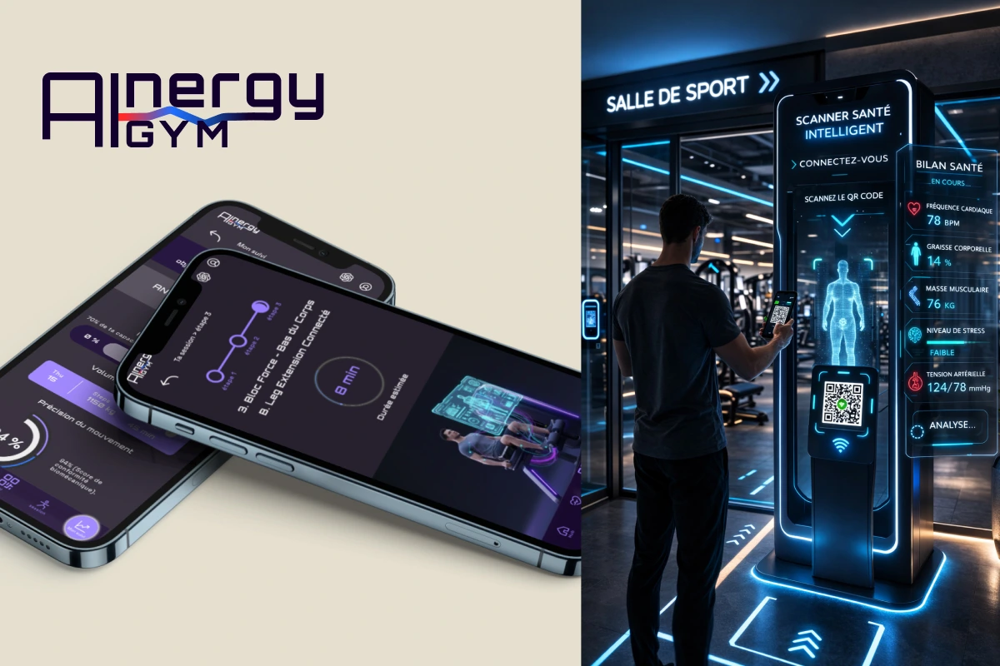
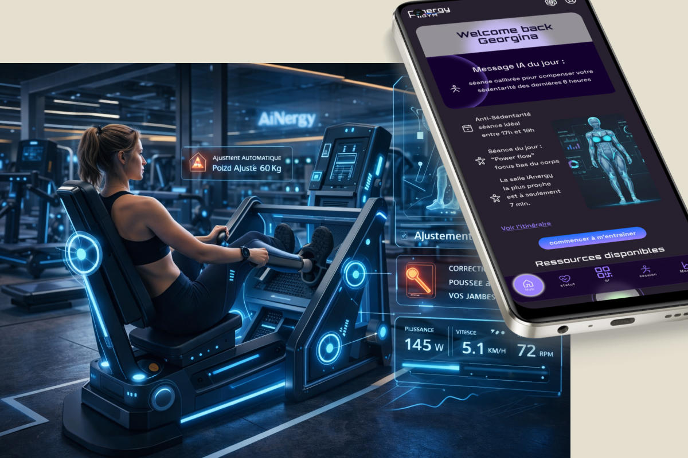
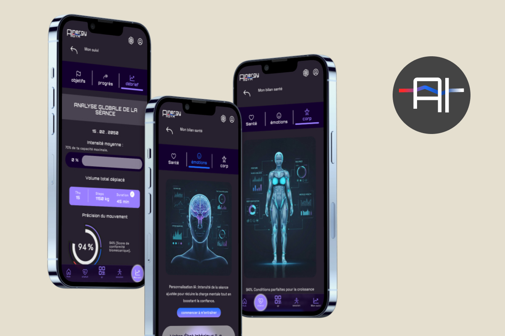

[breadcrumbs]

# IAnergy

Conception d'un prototype d'application futuriste projetée en 2050 — une salle de sport connectée où la technologie est au service de la performance et de la sécurité.

hero tags: UI /UX , Design, Figma, Prototype

**button** [https://www.figma.com/proto/3XxGNwAJSJ96fpnWF8ldzn/AInergy-2050?node-id=651-4551&viewport=-1159%2C-7%2C0.15&t=ient6rca6qPJcspD-1&scaling=scale-down&content-scaling=fixed&starting-point-node-id=651%3A4551&page-id=35%3A2]

<!-- Replace the link and alt img -->

---

01 - contexte

## Une salle de sport futuriste, conçue pour l'humain de 2050.

IAnergy est une application mobile connectée à une salle de sport futuriste imaginée en 2050. Elle accompagne les utilisateurs souhaitant adopter un mode de vie actif tout en prévenant les blessures, grâce à une analyse biométrique en temps réel réalisée dès l'entrée de la salle.

Role: UI/UX Designer & Webdesigner
Team: projet solo
Duration: 2 mois
Tools: Figma, Illustrator

---

02 - Problématique & objectifs

## Le point de départ

**Card1**

Problèmes
-Comment proposer une expérience sportive ultra-personnalisée dans un environnement futuriste ?
-Comment traduire des données biométriques complexes en une interface intuitive et désirable ?

**Card 2**

Objectifs
-Personnalisation : synchroniser les routines d'entraînement sur le profil biométrique de chaque utilisateur.
-Priorisation des fonctionnalités V1 grâce à la méthode MoSCoW, création du sitemap pour organiser l'architecture de l'information, puis conception des wireframes et des premières fondations de l'identité visuelle.
-Prévenir les blessures sans surcharger cognitivement l'utilisateur.

---

03 - Processus

## Quatre étapes pour concevoir une expérience fluide et intuitive.

**Card O1**

# 01

## Recherche & stratégie UX

Design Thinking pour l'idéation d'un concept futuriste, analyse concurrentielle des user journeys d'applications sport, définition des personas.

**Card O2**

# 02

## Cadrage du projet

priorisation des fonctionnalités et structuration du contenue

**Card O3**

# 03

## Conception visuelle & UI

Création de l'identité visuelle et de la charte graphique IAnergy, wireframes basse fidélité, prototypage haute fidélité avec interactions sur Figma.

**Card O4**

# 04

## Prototypage

Conception d'un prototype interactif haute fidélité. Une immersion dans le futur du sport

---

04 - Solution

# Une expérience sportive pilotée par la donnée en temps réel.

IAnergy s’appuie sur un scanner intelligent connecté à l’application. Situé à l’entrée de la salle, ce dispositif réalise un bilan biométrique instantané afin d’adapter automatiquement les recommandations sportives de l’utilisateur.

Les données collectées alimentent une interface personnalisée capable de proposer des routines optimisées, pensées pour améliorer la performance tout en réduisant les risques de blessure.

<!-- Replace the link and alt img -->

<!-- Replace the link and alt img -->

## ** button ** [[redirect to figma](https://www.figma.com/proto/3XxGNwAJSJ96fpnWF8ldzn/AInergy-2050?node-id=651-4551&viewport=-1159%2C-7%2C0.15&t=ient6rca6qPJcspD-1&scaling=scale-down&content-scaling=fixed&starting-point-node-id=651%3A4551&page-id=35%3A2)]

05 - Résultat

# Des résultats qui fleurissent

- Prototype interactif: simulant une expérience sportive futuriste basée sur l'analyse biométrique en temps réel
- Données complexes : traduites en visualisations claires, facilitant la compréhension rapide et la prise de décision
- Écosystème cohérent : combinant scanner intelligent et application mobile pour une expérience ultra-personnalisée et sécurisée

<!-- Replace the link and alt img -->

---

06 - Compétences

**Compétences UX/UI :**

- Analyse de la demande
- Benchmark concurrentiel
- priorisation fonctionnalités
- Définition personas
- Architecture de l'information
- Wireframing
- Prototypage haute fidélité
- Création identité visuelle & charte graphique
- Tests d'utilisabilité & itérations
