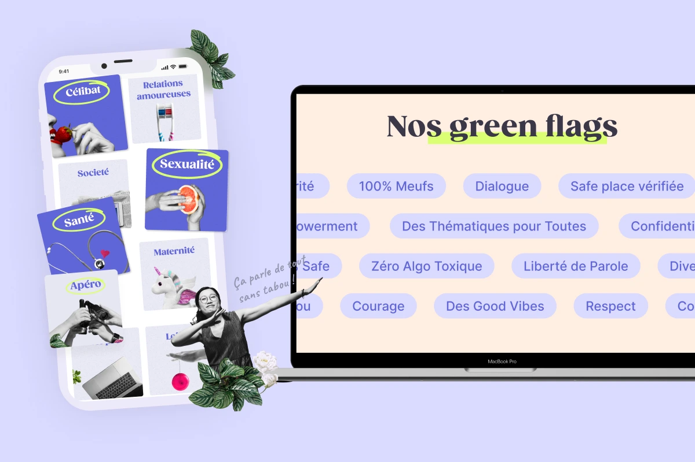
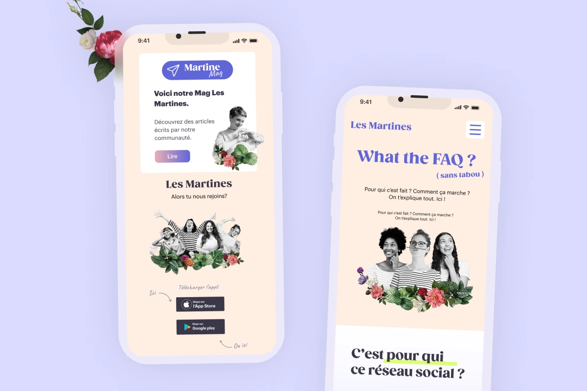

[breadcrumbs]

# Les Martines
Refonte du site vitrine d'une application dédiée aux femmes — un espace sûr et solidaire, raconté avec clarté, profondeur et identité.

hero tags: UI /UX , Design, Wordpress, Elementor Pro

**button** [https://www.lesmartines.app/]

<!-- Replace the link and alt img -->

---
01 - contexte
## Une application pour les femmes
Les Martines est une application dédiée aux femmes, offrant un espace sûr et solidaire pour échanger sur divers sujets. Lancée en 2023, elle évolue avec de nouvelles fonctionnalités et une communauté grandissante. Une refonte du site vitrine a été engagée pour mieux refléter son univers et centraliser ses informations.

Role: Webdesigner
Team: 1 webdesigner, 1 développeur, 1 product owner
Duration: 3 mois
Tools: Figma, WordPress Elementor Pro 

---
02 - Problématique & objectifs
## Le point de départ

**Card1**

Problèmes
-L'interface initiale (V1) présentait un déficit de hiérarchie visuelle et de profondeur, ne parvenant pas à valoriser la richesse fonctionnelle de l'application. Ce manque de structure nuisait à l'engagement des utilisatrices.

**Card 2**

Objectifs
- Conversion : CTA stratégiques pour maximiser les téléchargements.
- Storytelling & identité : valoriser l'ADN et les valeurs de la communauté.
- Visibilité & crédibilité : exposer clairement fonctionnalités et partenaires.
- Cohérence omnicanale entre l'application mobile et le site web.

---

03 - Processus 
## Quatre étapes pour concevoir une expérience fluide et intuitive.
**Card O1**
# 01
## Audit & Benchmark
Audit du site V1 et analyse concurrentielle : identification des points de friction et des opportunités d'amélioration.

**Card O2**
# 02
## Cadrage du projet
priorisation des fonctionnalités et structuration du contenue

**Card O3**
# 03
## Créations visuelles et tendances UI
Exploration du glassmorphism et utilisation d'éléments flottants pour créer une interface moderne, fluide et cohérente avec l'univers graphique du projet.

**Card O4**
# 04
## Intégration avec microanimations
Intégration WordPress avec Elementor Pro, créations des microanimations
---
04 - Solution
# Une refonte stratégique et mémorable.
La refonte s'articule autour de trois piliers : Conversion avec des CTA stratégiques pour maximiser les téléchargements, Storytelling & identité pour valoriser l'ADN et les valeurs de la communauté, et Visibilité & crédibilité grâce à une navigation intuitive exposant clairement les fonctionnalités et le réseau partenaires.

<!-- Replace the link and alt img -->

<!-- Replace the link and alt img -->

** button ** [[redirect to figma](https://www.lesmartines.app/)] 
---

05 - Résultat
# Des résultats qui fleurissent
- Omnicanal : cohérence visuelle totale entre l'app mobile et le site web
- V2 : passage d'un site confus à une plateforme structurée
- Réseau : partenaires mis en avant, ouvrant de futures collaborations

<!-- Replace the link and alt img -->

---
06 - Compétences

**Compétences UX/UI :**

- Benchmark concurrentiel
- Refonte hiérarchie visuelle
- UI moderne (glassmorphism, micro-animations) 
-Responsive design
- Optimisation conversion (CTA, QR code) 
-Intégration WordPress Elementor Pro 

