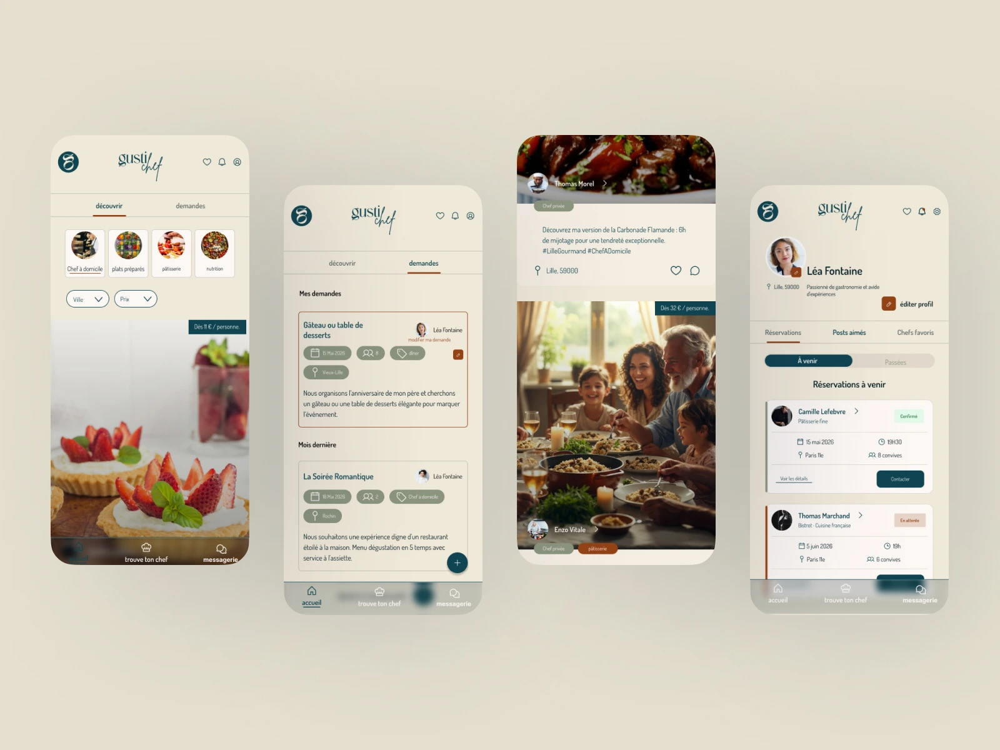
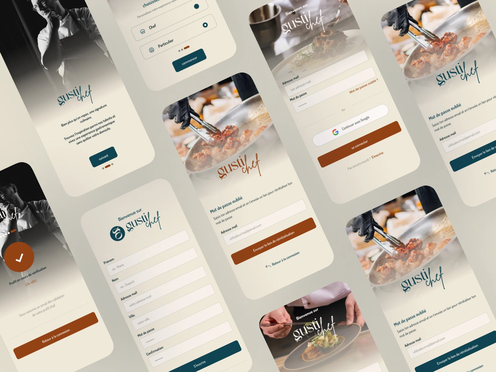

[breadcrumbs]

# Gusti-Chef
Gusti-Chef est une application conçue pour simplifier les démarches entre les chefs à domicile et leurs clients. L'interface a pour objectif de mettre en avant les créations culinaires, les plats et les moments de partage, tout en facilitant le contact et la réservation entre les deux parties.

hero tags: UI /UX , Design, Figma, Prototypage

**button** [https://www.figma.com/proto/B5Yh49C8D38H2nJgJ5FvS0/GustiChef?page-id=34%3A2&type=design&node-id=34-2&viewport=383%2C140%2C0.18&t=X2Vz8n40zYh26hX4-1&scaling=min-zoom&starting-point-node-id=34-2]

<!-- Replace the link and alt img -->

---
01 - contexte
## Une application au service des chefs et de leurs clients.
Gusti-Chef est une application conçue pour simplifier les démarches entre les chefs à domicile et leurs clients. L'interface a pour objectif de mettre en avant les créations culinaires, les plats et les moments de partage, tout en facilitant le contact et la réservation entre les deux parties.

Role: Webdesigner
Team: 1 DA, 1 marketing, 1 développeur, 1 webdesigner
Duration: 3 mois
Tools: Figma, Google Forms

---
02 - Problème et objectifs
## Problématique & objectifs

**Card1**

Problèmes
-De quelle manière une application mobile peut-elle simplifier le parcours de réservation d'un chef à domicile tout en garantissant un suivi de prestation rigoureux pour les deux parties ? 
-Comment valoriser les créations culinaires tout en facilitant la prise de contact et la réservation ?

**Card 2**

Objectifs
-Une solution centrée utilisateur visant à simplifier le parcours de réservation tout en assurant un suivi fluide des prestations.
-Profils chefs enrichis avec contenus visuels immersifs (photos, avis, présentation), messagerie intégré pour la communication directe avant réservation, suivi de prestation en timeline et système d'avis vérifiés.
-Deux parcours distincts (client et chef) conçus pour répondre aux besoins spécifiques de chaque utilisateur.

---

03 - Process
## Quatre étapes pour concevoir une expérience fluide et intuitive.
**Card O1**
# 01
## Benchmark concurrentiel
Analyse des sites et applications disponibles sur le marché. Identification des fonctionnalités UX et des tendances UI.

**Card O2**
# 02
## Recherche utilisateurs
Analyse de l'enquête : sondage côté client, Synthèse des priorités de conceptio et Analyse de l'entretien exploratoire

**Card O3**
# 03
## Prototypage & validation utilisateur
Création du prototype haute fidélité, tests utilisateurs et optimisations de l’expérience

**Card O4**
# 04
## Guide d'utilisation
Transmission du prototype interactif, guide d’utilisation et documentation
---
04 - Solution
# Deux parcours, une expérience fluide et centrée utilisateur.
Une interface centrée sur la confiance et le partage : chaque profil chef devient une vitrine culinaire, chaque réservation s'accompagne d'un suivi clair pour les deux parties.

<!-- Replace the link and alt img -->

<!-- Replace the link and alt img -->

** button ** [redirect to figma] 
---

05 - Résultat
# [Section Title]
- Prototype interactif : clair et intuitif couvrant deux parcours distincts (client et chef)
- Parcours utilisateur : défini et validé par les tests [Description] 
- Vue client et chef : conçue pour répondre aux besoins spécifiques de chaque utilisateur

<!-- Replace the link and alt img -->

---
06 - Skills
# [Title]
- Benchmark concurrentiel
- UX Research (questionnaire + entretiens) 
- Définition personas
- Architecture de l'information (Sitemap)
- Wireframing basse fidélité
-Prototypage haute fidélité (Figma)
-Tests utilisateurs & itérations
-Guide d'utilisation 

